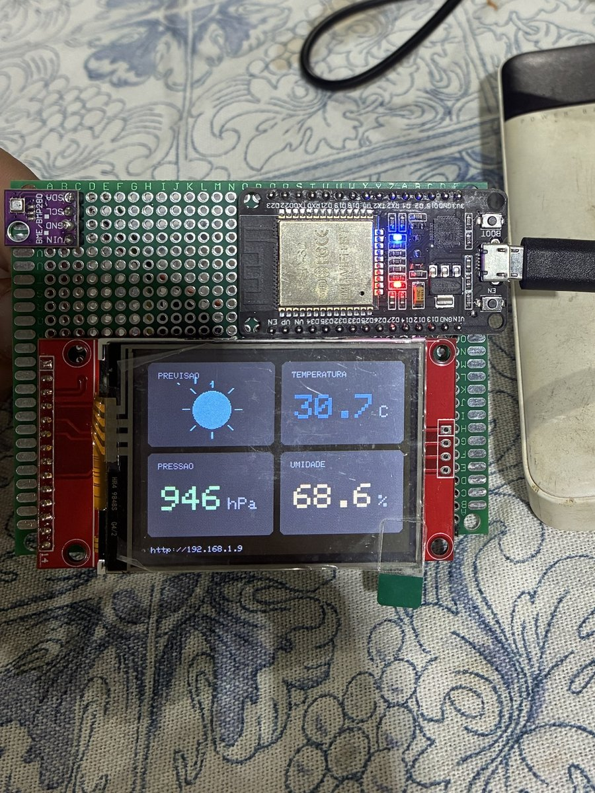
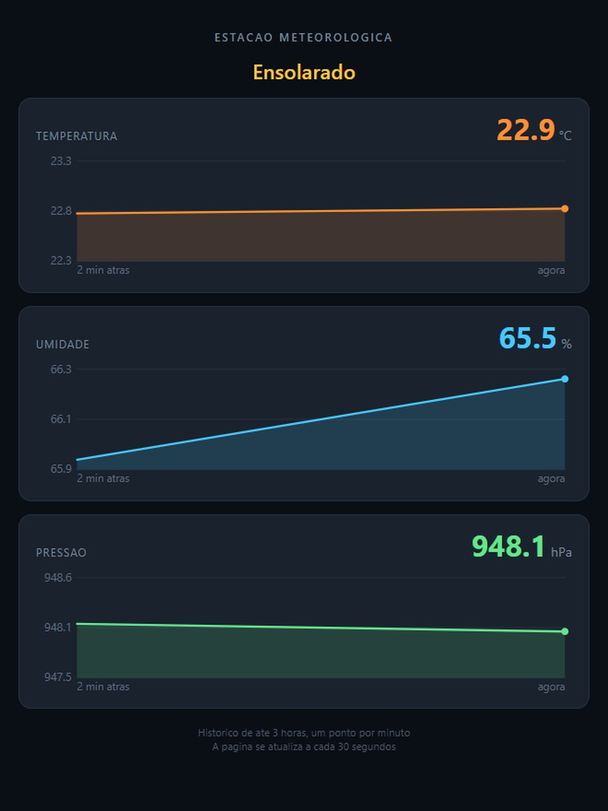

# Estação Meteorológica com ESP32

Estação meteorológica com ESP32 e sensor BME280. Mostra temperatura, umidade, pressão e previsão do tempo num display TFT 2.4" e numa página web na rede local, com histórico das últimas 3 horas em gráficos.

<p align="center">
  
  
</p>

## Funcionalidades

- Leitura de temperatura, umidade e pressão pelo sensor BME280
- Display TFT 2.4" com quatro quadrantes e ícone de previsão do tempo
- Página web na rede local com os valores atuais
- Histórico das últimas 3 horas em gráficos SVG gerados pelo próprio ESP32
- Previsão simples baseada na pressão convertida para o nível do mar

## Estrutura do repositório

```
estacao_meteorologica/
  estacao_meteorologica.ino     programa principal
testes/
  teste_sensor/                 identifica o sensor no barramento I2C
  leitura_bme280/               lê o sensor e imprime no Serial
  teste_memoria_display/        descobre o tamanho real da memória do display
```

O Arduino IDE exige que cada sketch fique numa pasta com o mesmo nome do arquivo `.ino`. Por isso cada programa tem a sua.

## Hardware

| Componente | Modelo |
|---|---|
| Microcontrolador | ESP32 DevKit V1 (chip serial CH9102) |
| Sensor | BME280 (I2C, endereço 0x76) |
| Display | TFT 2.4" SPI 240x320, controlador compatível com ILI9341 |
| Alimentação | Fonte USB 5V 1A |

## Ligações

### Sensor BME280

| Sensor | ESP32 |
|---|---|
| VIN | 3V3 |
| GND | GND |
| SCL | D22 |
| SDA | D21 |

### Display TFT

| Display | ESP32 |
|---|---|
| VCC | 3V3 |
| LED | 3V3 |
| GND | GND |
| CS | D15 |
| RESET | D4 |
| DC | D2 |
| SDI (MOSI) | D23 |
| SCK | D18 |
| SDO (MISO) | D19 |

Os pinos de touch (T_IRQ, T_DO, T_DIN, T_CS, T_CLK) e os do cartão SD ficam desconectados.

Alimente tudo em 3.3V. O módulo do display não tem regulador nem conversor de nível.

## Bibliotecas

Instale pelo Gerenciador de Bibliotecas do Arduino IDE:

- Adafruit BME280 Library
- Adafruit ILI9341
- Adafruit GFX Library
- Adafruit Unified Sensor

## Como usar

1. Abra `estacao_meteorologica/estacao_meteorologica.ino` no Arduino IDE.
2. Preencha o nome e a senha da sua rede WiFi no início do arquivo:

   ```cpp
   const char *WIFI_SSID  = "SEU WIFI AQUI AMIGO";
   const char *WIFI_SENHA = "SUA SENHA DO WIFI AQUI AMIGO";
   ```

   O ESP32 só conecta em redes de 2.4 GHz.

3. Ajuste a altitude do seu local, em metros. Ela é usada para converter a pressão medida em pressão ao nível do mar, que é o valor usado na previsão:

   ```cpp
   #define ALTITUDE_LOCAL 617.0f
   ```

4. Selecione a placa **ESP32 Dev Module** e a porta que aparece com o nome do chip serial (CH9102, CP210x ou CH340). Nunca uma porta Bluetooth.
5. Grave. O endereço da página web aparece no rodapé do display e no Serial Monitor a 115200.

> Depois de preencher o WiFi, não faça commit do arquivo com os seus dados reais.

O histórico fica na memória RAM e é perdido se a placa reiniciar ou ficar sem energia.

## Sobre o display clonado

O display usado neste projeto é vendido como ILI9341, mas é um clone que não se comporta como o original. Foram necessários três ajustes, todos no programa principal:

**A área visível é 320x240, não 240x320.** A biblioteca acha que a tela tem 240 de largura e nunca desenha nos 80 pixels restantes, deixando uma faixa fixa na lateral. A classe `TelaCorrigida` informa o tamanho verdadeiro com `definirTamanhoReal()`.

**O comando de rotação não se comporta como esperado.** Neste painel, a orientação paisagem correta é obtida com `setRotation(0)`, e não com 1 ou 3.

**A memória precisa ser limpa em modo bruto na inicialização.** As áreas que a biblioteca não alcança guardam lixo de quando o display liga. O método `limparTudo()` escreve direto na memória do controlador para apagá-las.

Se o seu display for um ILI9341 original, use `Adafruit_ILI9341` diretamente no lugar de `TelaCorrigida`, com `setRotation(1)`, e remova as chamadas `limparTudo()` e `definirTamanhoReal()`.

Para descobrir se o seu painel tem o mesmo problema, grave o `teste_memoria_display`: ele pinta a tela em vários tamanhos e mostra qual cobre a área inteira.

## Sketches de teste

| Pasta | Para que serve |
|---|---|
| `testes/teste_sensor` | Varre o barramento I2C e identifica o chip pelo ID: `0x60` é BME280, `0x58` é BMP280 |
| `testes/leitura_bme280` | Lê o sensor e imprime os valores no Serial, sem display |
| `testes/teste_memoria_display` | Pinta a memória do display em vários tamanhos para descobrir a área real |

## Problemas comuns

**Tela branca, sem imagem.** Confira CS, DC e RESET. Os pinos D2 e D4 são vizinhos no ESP32 e trocá-los é o erro mais frequente.

**Faixa sem pintar na lateral da tela.** É o display clonado. Veja a seção acima.

**Sensor não responde.** Rode o `teste_sensor`. Se nenhum dispositivo aparecer, o problema costuma ser alimentação: confira a solda do VIN, que pode parecer boa e não ter contato.

**Erro "Write timeout" ao gravar.** Porta errada. O ESP32 aparece com o nome do chip serial, não como porta Bluetooth.

**Umidade sempre em zero ou nan.** O chip é um BMP280, não um BME280. Ele só mede temperatura e pressão.

## Licença

MIT
